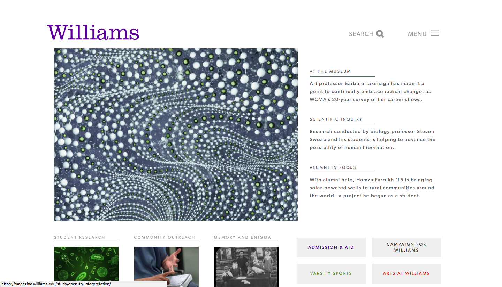
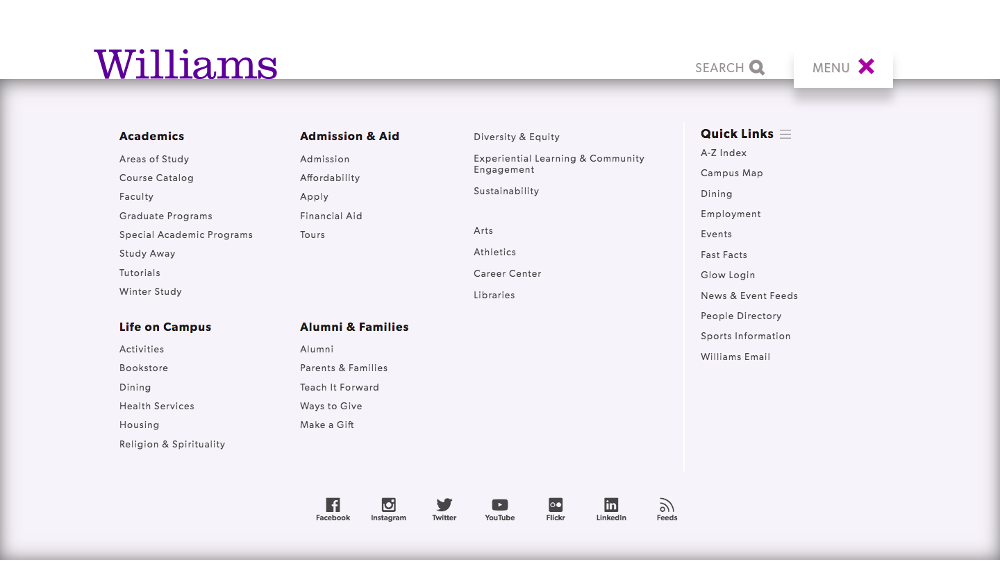
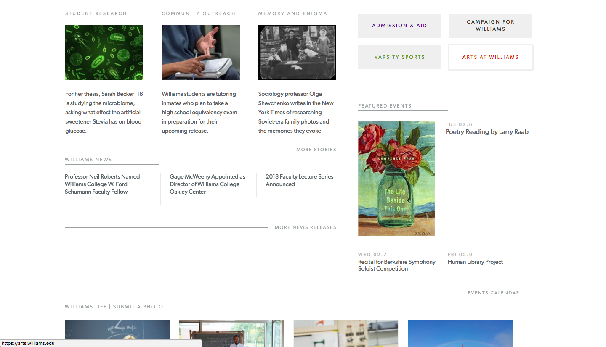
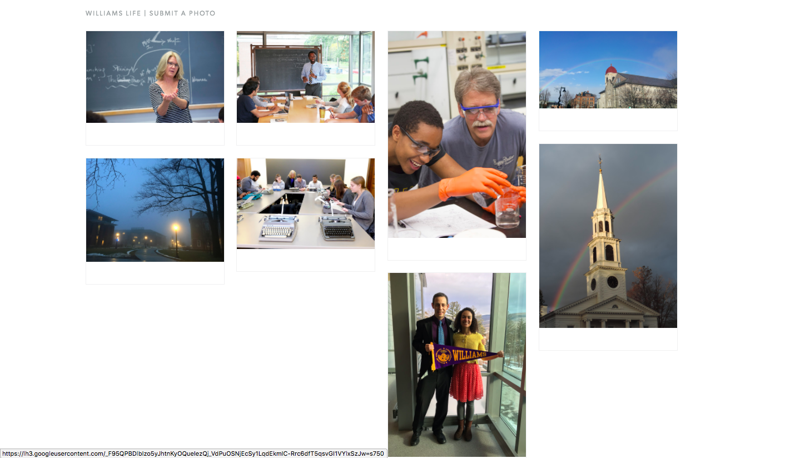

The Williams College homepage is an example of good design choice. As an institution of higher education, the creator of the Williams College webpage has aggregated all information relevent to its operation. The creator is careful in creating a clear interface where visitors can easily navigate and find what they're looking for. Naturally, Admission and Aid, Varsity Sports, and Arts at Williams are subjects thought to be statistically relevent information for the demographics of maturing high school students and aging parents. Campaign for Williams is left there for alumni and donors wishing to give back to the school and support its commitment to educating the new generation.

If you already know what you've exactly came for, the obvious search function on the top of the page provides the means to access it directly. Othewise, clicking on the menu button to the right of it will give the drop down menu that spans the entire page. From there, you can access all of the different facets of the collegiate experience in a detailed and organized series of lists that either expand or add missing details that the four grey square boxes housing links did in the paragraph before. 

Scrolling down the page, we find that details pertaining to Williams student life populates the left hand corner of the screen. While this gives a general insight into what's occuring at the college, Williams News crouches right beneath it to give a day by day update on what is currently going on at Williams. 

When you scroll to the very bottom of the webpage, you'll find a series of photos displaying Williams in action. After sifting through the well spaced out textual information at the top of the page, you can come across its visual equivalent to get a keen sense of how Williams really is.
