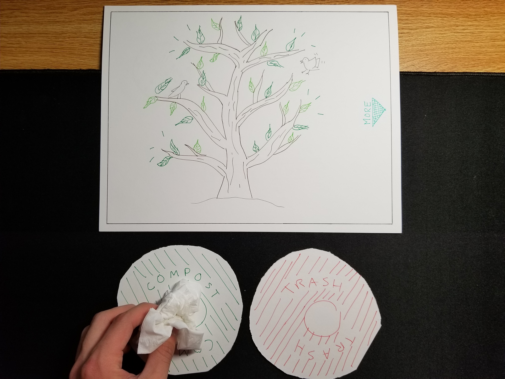
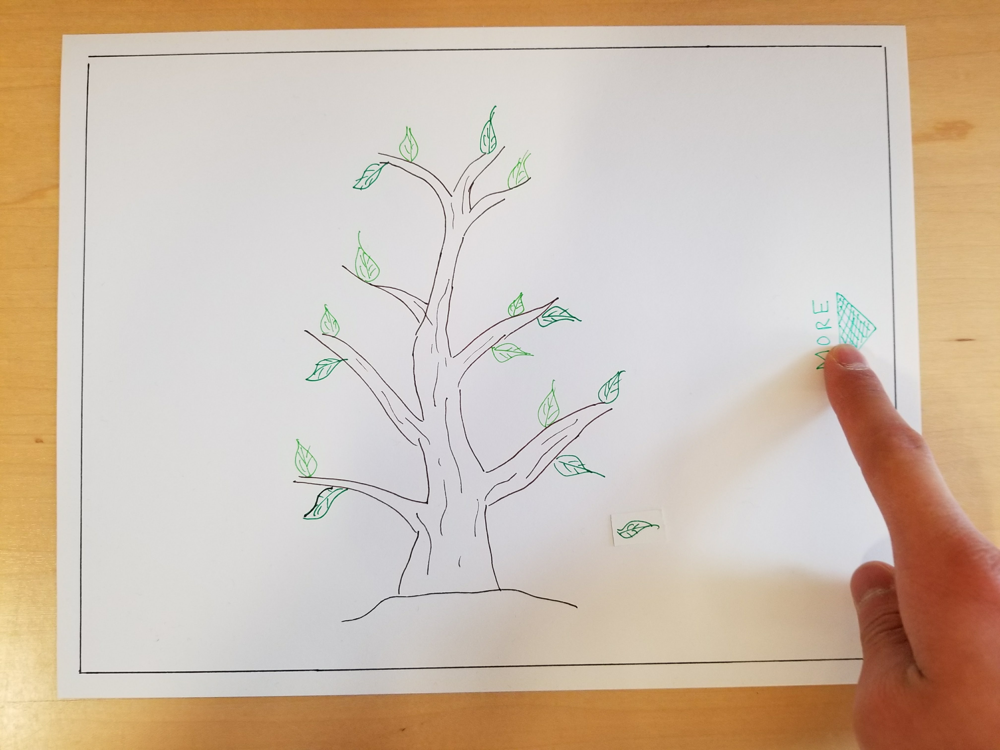

# Design Manifesto

## Introduction

Taking the course Human Computer Interaction opened my eyes and molded them to be critical of the structure of many products I took for granted. Indeed, design is inherently everywhere as choices to make [door ways](https://glow.williams.edu/courses/2221560/files/folder/readings?preview=123981970)
to choices on how to make hand held applications impact the relationship between the user and their environment. Throughout the semeseter, I spent time with two other students developing a design that became the hypothetical product Trendy Trash (link). During this process, we learned a lot along the way about the cornerstones of design and the many formulas needed to craft a working and effective product. 

To me, design is analogous to art. Art requires one to be cognizant of one’s audience, oneself, and what one wants to accomplish if anything at all. However, where art may not need to explain itself to gazes that do not comprehend its meaning, design does. The art form of designing lies in accessibility, ethical grounding, and functionality.

Here are five main points that have defined my design process.

## Design is in the Eye of the Beholder

When we first met together and tried to come up with a comprehensive design, we did not know how much was missing from the overall product at all. In our minds, we were done. We didn’t consider how much we had left to improve. In fact, we thought that it was intuitive and that our users would naturally understand what our design was attempting to be. However, our contextual inquiries proved that this was incorrect.

Some people saw what we were trying to do during usability testing of course. Put compost in the compost bin and you’ll see a tree grow big and strong signaling positive feedback. Put trash into the trash bin and it would shrink, indicating negative feedback. However, one person had trouble understanding what went wrong when putting trash in the trash bin. Person X thought that by correctly categorizing her waste that she was making a difference. That’s when I discovered that different people had different interpretations of saving the environment at a given time. From that point, people have different biases and interpretations when it comes not only to interacting with a design but also making a design. While our focus was on the user, the spotlight was angled back at us, the designers. Knowing that there were different interpretations of what our design did, it prompted us to revise our version of the design for clarity. This bring me to my next point.

## Clarity in Accessibility

Everyone has different perceptions of the world and thus a different relationship to the world in terms of their interactions. Accessibility digs into how different people interact in their relationship to the world. Designing for accessibility is not only a morally just act but also paves the way for clarifying one’s own design. 

When everyone first presented their designs in class, one could immediately tell that these designs weren’t made with people with disabilities in mind. This again, is a natural bias that we learned to strip from our design process. Some designs heavily relied on the use of pictures as ours did, to convey information to their users. However, users who are visually impaired may find a design of that particular kind inaccessible without the presence of alt text. For our design in particular, we rely on the picture of a tree to convey positive and negative feedback. Luckily from the outset, we always had a paired audio cue in mind with each that would further reinforce these notions but what one should focus on is that by having a feature that makes a design more accessible, it ameliorates the design in clarity.

## Ethically Designing

Certainly, when one thinks of Trendy Trash, one doesn’t think that ethics could come into play. Honestly, I can’t think of a way our design could be ethically misguided. However, designers should be wary about the way their designs may interact with the realm of ethics. In the case of Facebook for example, the site actively aggregates information about its users and adjusts their ad content accordingly in order to generate revenue for those sites. A site that has control of users ad content and news feed posts has a lot of responsibility in how the specific content can impact users. This became an issue when a [psych study wanted to use Facebook’s ability to control news feeds to see how users react to positive and negative content](https://www.nytimes.com/2014/06/30/technology/facebook-tinkers-with-users-emotions-in-news-feed-experiment-stirring-outcry.html). 

> “The researchers found that moods were contagious. The people who saw more positive posts responded by writing more positive posts. Similarly, seeing more negative content prompted the viewers to be more negative in their own posts.” 

Naturally, this stirred an uproar since mental health is a delicate issue and should not be manipulated in such a manner. While users agreed to these psych studies in the terms of service when signing up, Facebook still holds responsibility for worsening the quality of some of their users’ lives by doing so.

When one designs, one should always keep in mind the broader implications of their design. 

## Organization of Information and Feedback is Key

Feedback is a natural element in the design process. It’s required for one’s design to grow and mature into the final product. If a designer is carrying out the process correctly, they will receive a ton of feedback. Navigating through that feedback will be the most difficult part of that process due to:

- Feedback being qualitative as well as quantitative
- The type of feedback
- The significance of that feedback

Quantitative feedback is much easier to organize and derive a conclusion from. One only needs the correct statistical formula to derivate a general idea about users’ wants and needs. Qualitative data is an uglier beast to tackle. This is especially true since everyone has different perceptions of the particular feedback, including the user. Hence, what’s truly being implied by the response can be lost in the dilution of subjective lenses.

A successful countermeasure, affinity diagramming, allowed us to parse through feedback from our contextual inquiries very easily due to its categorical nature. At the same time, the method allows for the exclusion of designer biases as we categorized information in a manner that focuses on the users’ concerns, wants and needs. Beyer and Holtzblatt even recommend to taboo certain words as category names to avoid designer biases. The takeaways of an affinity diagram are usually the most beneficial stepping stones for a designer and their project.

## Let Go of Your Ideas

Design is going to kick your butt and your ego at times. Maybe you thought that your idea was the best out of your team and we should implement it right away. Maybe you thought your idea should take precedent over the what the users want because you may know better than the users about what they want.

Maybe you’re wrong.

Sometimes, ideas will have to be dropped. We can’t win every battle in the war to form a design. A great designer knows when to retreat, assess the situation, and retaliate having learned from their defeat. Iteration is part of the design process and in order for a design to grow, it must shed its baggage. This is especially true of web designs that employ to much extraneous information on one page. 

For our project, we wanted a seamless, minimalist interface that stimulated a user’s curiosity and invited them to explore the design. However, we learned to let go of such a bare bones skeleton and implemented labels and language to the interface so that people could have a better understanding of what they were looking at. Our usability tests did better because of that and so did our design. 

Letting go makes room for more. Always go for more.
